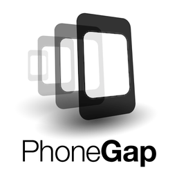
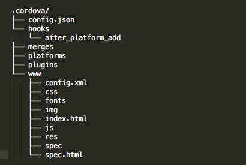
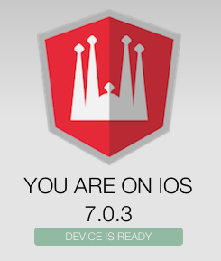

# HTML5 mobile apps 
with Apache Cordova and AngularJS

by [@_sgimeno](http://www.twitter.com/_sgimeno) and [@amatiasq](http://www.twitter.com/amatiasq)


---
## What is Cordova / Phonegap?

>Cordova is an open-source mobile development framework. It allows you to use standard web technologies such as HTML5, CSS3, and JavaScript for cross-platform development, avoiding each mobile platforms' native development language.



--
## Cordova background

 + Embeds HTML5 code inside a platform WebView
 + Makes device features accessible from JavaScript
 + Able to be extended with native functionaity via plug-ins
 + Web based mobile app you can put in iOS App Store, or Google Play Store
 + Build & deploy tools allow you to write 1.5x and run everywhere
 + Can be used with many web frameworks (JQM, Sencha, Ionic)

--

## Platforms

We need each platform **SDK** to deploy our application


...Windows Phone, BlackBerry, webOS, Bada...

--

## Building commands

Add a platform
 ```
 cordova platform add <ios|android|blackberry>
 ```
 Add a plugin
 ```
 cordova plugin add org.apache.cordova.file
 ```
 Build
 ```
 cordova build [platform]
 ```

 Emulate
 ```
 cordova emulate [platform]
 ```

 Run
 ```
 cordova run [platform]
 ```
 Develop in a browser
 ```
 $ cordova serve [platform]
 ```

<small>If you are on iOS, you will need to test on simulator.</small>

--

## Cordova project structure


  
</pre>


--

## Express Cordova install

```
npm install -g cordova # cordova@3.3.1
```

---
## The workshop

+ STEP-0: Boot the HelloWorld app
+ STEP-1: AngularJS meets Cordova
+ STEP-2: Collect device pictures
+ STEP-3: Build a simple game using some API's 


--
## Tools

We need `grunt-cli` and `npm` for resolving dependencies and development.

And, of course, an editor and a browser 


---


## STEP 0

Set it up

```
$ git clone git@github.com:agilogy/angular-memory-game.git
$ npm install
$ cordova platform add <ios|android>
$ cordova serve
$ grunt ## watch sources for development
$ git checkout step-0
$ git checkout -b new_branch
```

Point your browser to `http://localhost:8000/<platform>/www/index.html`

<small>If you are on windows, you will need to also run bower install</small>

---
## STEP 1

Do not call Cordova (native) javascript functions until deviceready fires 

```
document.addEventListener('deviceready', function(){
  // cordova and device objects available
}, false);
```
--
## STEP 1

 Do it the Angular way

 Handle `'deviceready'` event with a promise

```
var deferredReady = $q.defer();
...
$document.addEventListener('deviceready', function() {
      deferredReady.resolve($window.device);
    });
...
```
--

### Let's code:

 + Make a `cordovaService` to handle `deviceready`
 + Show your device platform and version on the screen



---
## STEP 2

Getting the pictures in the phone

```
  function getFileSystem() {
      var deferred = $q.defer();

      function fail() {
          deferred...
      }

      function gotFS(fileSystem) {
          deferred...
      }
        
      //Cordova File API
      window.requestFileSystem(LocalFileSystem.PERSISTENT, 0, gotFS, fail);

      return deferred.promise;
    }
```
--

## STEP 2

Interacting with a Cordova API using promises

```
.factory('fileService', function($window, $q, cordovaService) {

  ...

  return {
    getFileSystem: function(){
      return cordovaService.$ready
        .then(getFileSystem);
    },
    readPictures: function(){
      return cordovaService.$ready
        .then(getFileSystem)
        .then(readPictures);
    }
  }
});
```

--
### Let's code:

Finish the fileService and show some of the phone pictures in a carousel


---
## STEP 3 

Add some awesome modules to your project using *bower* to build some cool game or app


--

##STEP 3

These are some great starting points

+ [Snap.js](https://github.com/jtrussell/angular-snap.js-bower)
+ [PureCSS](http://purecss.io/)
+ [Angular gestures](https://github.com/wzr1337/angular-gestures)
+ [Metro Bootstrap](http://talkslab.com/metro-bootstrap)
+ [Ionic Framework](http://ionicframework.com/)
+ [Angular Carousel](https://github.com/revolunet/angular-carousel)


---

#Thank you!

